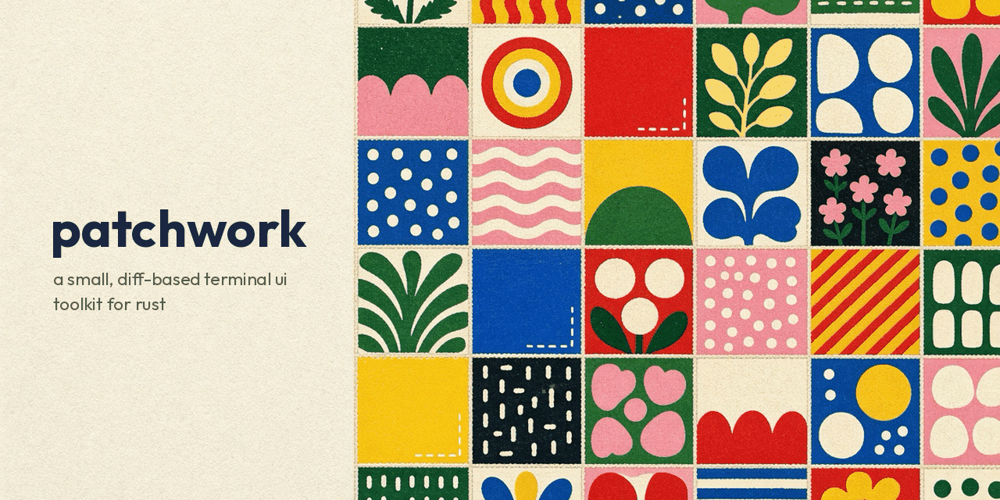

<p align="center">
  
</p>

# patchwork

A small terminal UI toolkit for Rust, built directly on `libc`. patchwork
manages the TTY (raw mode, the alternate screen, `SIGWINCH` resizes) and draws
to the screen with a double-buffered, diff-based renderer that only emits the
cells that actually changed.

> **Status:** 0.2.0 — early and experimental. The public API will change.

## Concepts

A **Buffer** is a grid of cells holding one frame's screen content. A
**Surface** is a clipped view onto a Buffer: it takes local coordinates, and
discards anything drawn outside its bounds. A **Drawable** — a primitive
(Dot, Line, Rect, Text), a decoration (Border, Fill), or a **Pane** — paints
onto a Surface it's given. A Pane is a layout-tree node: it paints its own
background, then stacks its child Panes on top.

Painting is **immediate mode**: acquire a Surface, draw, present, repeat,
with nothing kept between frames. See [`CONTEXT.md`](CONTEXT.md) for the
full glossary.

patchwork is a Rust library, but it isn't Rust-only: `src/ffi.rs` exposes an
immediate-mode **C API** — a renderer, one draw call per primitive, and a
present — so it can be embedded from C/C++ too. See
[`examples/nyancat`](examples/nyancat) for an end-to-end demo driving the C
API from real C++.

## Features

- **Raw-mode TTY session** with RAII cleanup — the terminal is always restored
  on exit, even on early return.
- **Alternate-screen** handling so the user's scrollback is left untouched.
- **Resize handling** via a self-pipe driven by a `SIGWINCH` signal handler.
- **Double-buffered renderer**: draw into a back buffer, then `draw()` diffs it
  against the front buffer and writes only the changed cells as ANSI escapes.
- **Styled cells**: 16-color, 256-color, and 24-bit truecolor, plus bold and
  underline.

## Platform support

Unix-like systems only (Linux, macOS). The TTY layer talks to `libc` directly,
so Windows is not supported.

## Running the demo

```sh
cargo run
```

This opens a framed, centered demo on the alternate screen that echoes the last
key you pressed and repaints on resize. Press `q` to quit.

## Using it

```rust
use patchwork::Draw;
use patchwork::buffer::{Color, Style};
use patchwork::renderer::Renderer;
use patchwork::shape::Dot;
use patchwork::terminal::Terminal;

let mut term = Terminal::new()?;
let size = *term.size();
let mut renderer = Renderer::new(size.rows, size.cols);

// Acquire a blank frame as a Surface, and paint into it...
let mut surface = renderer.frame();
Dot {
    x: 0,
    y: 0,
    style: Style { fg: Color::Rgb(120, 200, 255), ..Style::DEFAULT },
}
.draw(&mut surface);

// ...then flush only the changed cells to the terminal.
renderer.draw()?;
```

## Development

```sh
cargo test            # run the unit tests
cargo clippy          # lint
cargo fmt             # format
```

## License

MIT — see [LICENSE](LICENSE).

---

Repository: <https://github.com/TheCloudlet/patchwork>
